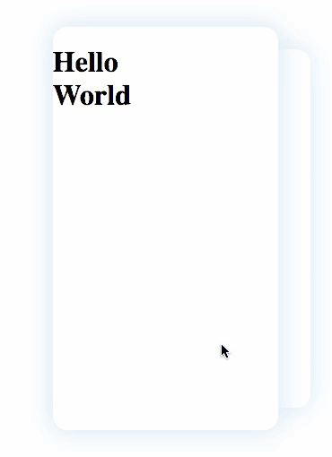

# Vue swiper

一个 vue 写的简单层叠卡片页面展示组件



## 特性

- 左右滑动换页
- 点击换页
- 循环和不循环两种模式
- 支持无数据时的提示页

## 使用说明

只需要在你的项目中引入

```html
<vue-swiper v-model="index" ref="swiper">
    <h1>Hello World</h1>
    <h1>This Is</h1>
    <h1>vue-swiper</h1>
    <h1 slot="nodata">No Data</h1>
</vue-swiper>
```

### v-model

支持双向绑定数据，如[使用说明](#使用说明)中那样，该 **value** 值为当前正在显示卡片的序号（从 0 开始）。

### props

- **loop**\<Boolean\>: 是否循环显示卡片
- **async**\<Any\>: 如果你的 Slot 数据是异步增加的，请将能反应你 Slot 变化的变量绑定到该 props
- **swipe**\<Boolean\>: 是否能够滑动
- **can-go-left**\<Boolean\>: 是否能够左滑动
- **can-go-right**\<Boolean\>: 是否能够右滑动
- **value**\<Number\>: 当前活动的卡片序号（从 0 开始）
- **deltaX**\<Number\>: 左右滑动的阈值，小于该值的滑动不会触发翻页（为防止误操作）

### method

- **prev(n)** 显示上 n 页（n 默认为 1）
- **next(n)** 显示下 n 页 （n 默认为 1）
- **goto(n)** 跳转到第 n 页

注：使用此特性需要要求在 **vue-swiper** 组件上设置 **ref** 属性，像[使用说明](#使用说明)中那样，然后你就可以在父组件中调用子组件的方法了。

如：

```JavaScript
this.$refs.swiper.next(); // 让子组件切换到下一章卡片
```

## 运行

只需要在本地安装 [Parcel](https://parceljs.org/)

```bash
yarn global add parcel
# 或者用 npm 安装
npm i -g parcel
```

然后执行下面命令检出项目

```bash
git clone https://github.com/AielloChan/vue-swiper.git
cd vue-swiper
parcel serve src/index.html
```

等构建完成后，打开浏览器输入 [localhost:1234](http://localhost:1234) 一切都搞定！

## 作者

[Aiello Chan](https://github.com/AielloChan/vue-swiper)